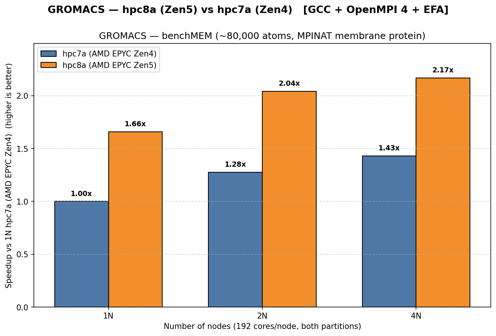
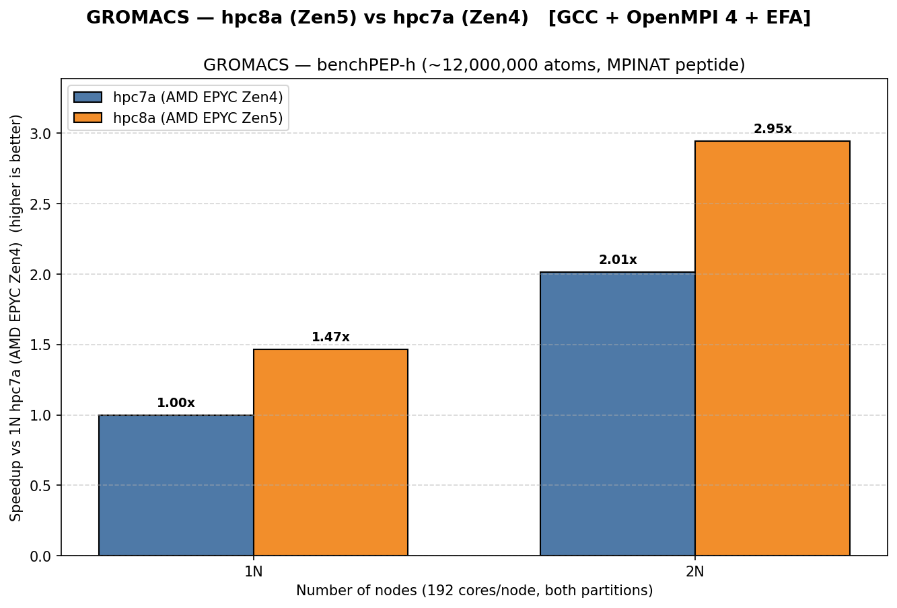
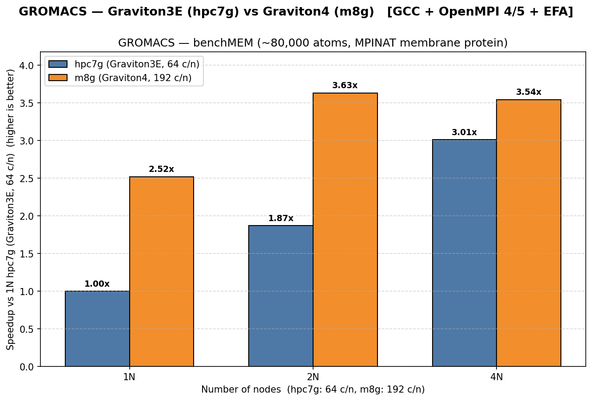
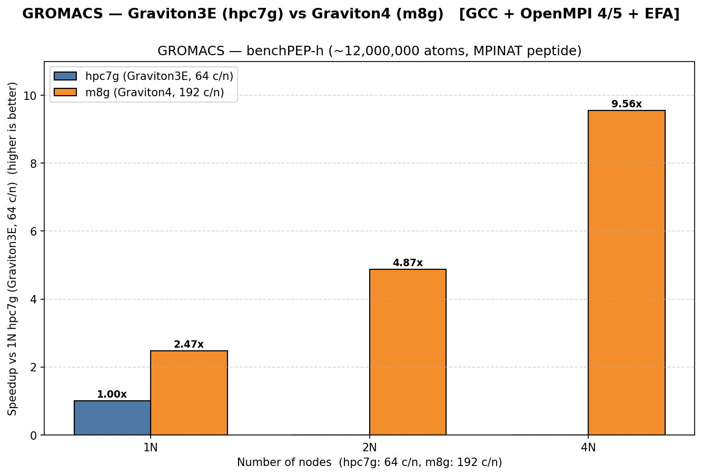
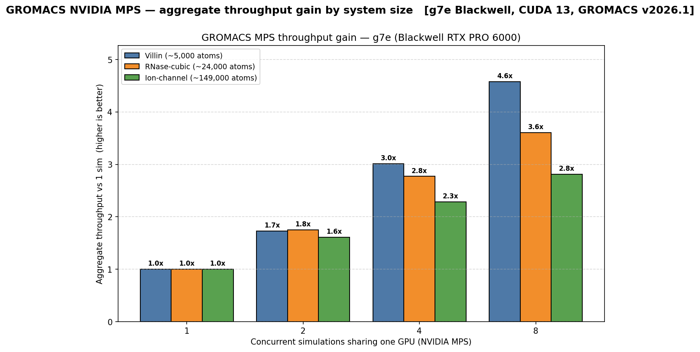
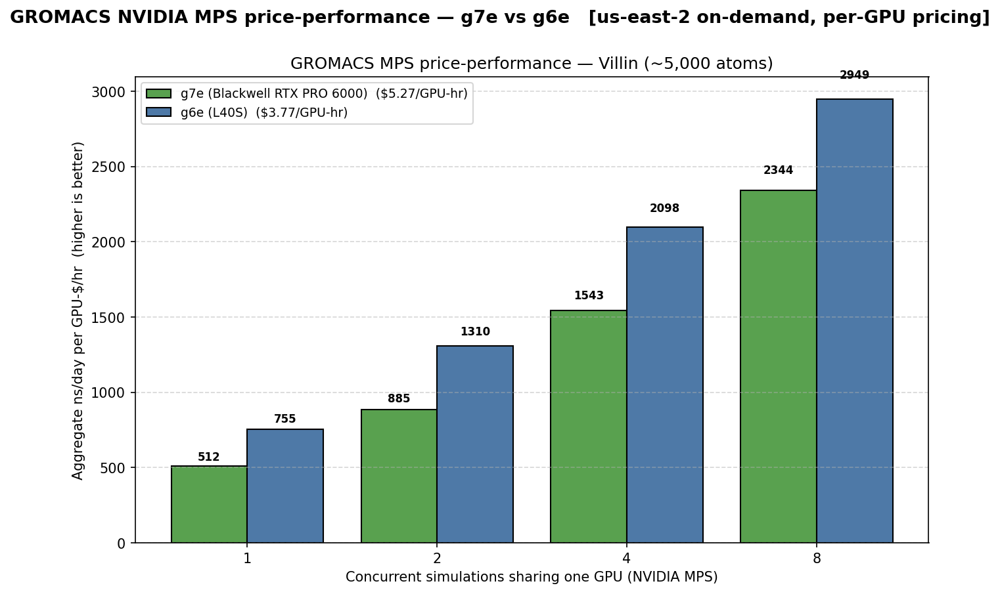

# GROMACS

This directory contains scripts for building and benchmarking [GROMACS](https://www.gromacs.org/) on AWS HPC instances. GROMACS is the workhorse open-source molecular dynamics package for biomolecular simulation — proteins, lipids, nucleic acids, and condensed-matter systems.

The scripts are organised by CPU architecture:

- [`x86/`](x86/) — builds and benchmarks for x86_64 (`hpc8a`, `hpc7a`)
- [`Arm/`](Arm/) — builds and benchmarks for aarch64 (`hpc7g` / Graviton3E, `m8g` / Graviton4)
- `GPU/` — CUDA 13 build scripts for `g6e` (L40S), `g7e` (Blackwell RTX PRO 6000), and `p5` (H100), plus the NVIDIA MPS GPU-sharing benchmark that is the recommended throughput pattern (see Performance → GPU)

Unlike LAMMPS, GROMACS ships **two binaries per build**: `gmx` (Thread_MPI, single-node) and `gmx_mpi` (Library_MPI, multi-node over EFA). Both binaries come from the same build script — they're separate CMake trees installed side-by-side under `tmpi/` and `ompi/`. The benchmark launcher picks the right one based on `SLURM_JOB_NUM_NODES`: 1 node → `gmx`, >1 node → `mpirun … gmx_mpi`.

## Build Variants

### x86 — Thread_MPI + Library_MPI (Phase 1, Validated)

A single build script produces **both** variants in one job — two CMake trees, two installs, two env scripts. Targets hpc8a (Zen5) and hpc7a (Zen4) using GCC + system OpenMPI 4.1.7:

```bash
sbatch x86/build_gromacs_x86.sbatch
```

- Compiler: GCC 11.5 (system, AL2023)
- Flags: `-O3 -march=x86-64-v4 -mtune=znver4 -DNDEBUG` (AVX-512, Zen 4/5 tuning)
- SIMD: `-DGMX_SIMD=AVX_512`
- FFT: in-tree FFTW3 via `-DGMX_BUILD_OWN_FFTW=ON`
- MPI: system OpenMPI 4.1.7 at `/opt/amazon/openmpi` (EFA-enabled at runtime)
- Build time: ~25–30 minutes (both variants)

Outputs:

| Variant | CMake | Binary | Install location | Env script |
|---------|-------|--------|------------------|------------|
| Thread_MPI | `-DGMX_MPI=OFF -DGMX_THREAD_MPI=ON` | `gmx` | `/fsx/gromacs/x86_64/<tag>/tmpi/bin/` | `gromacs-<tag>-tmpi-env.sh` |
| Library_MPI | `-DGMX_MPI=ON -DGMX_THREAD_MPI=OFF` | `gmx_mpi` | `/fsx/gromacs/x86_64/<tag>/ompi/bin/` | `gromacs-<tag>-ompi-env.sh` |

GCC 11.5 doesn't know `znver5`, so Zen 5 (hpc8a) is compiled with `-mtune=znver4` — AVX-512 is still emitted and the binary runs at full speed on Zen 5. Same trade-off the LAMMPS x86 build makes.

Override via `--export=ALL,...`:

| Variable | Default | Description |
|----------|---------|-------------|
| `GROMACS_TAG` | `v2024.4` | Git tag from the [GROMACS GitLab](https://gitlab.com/gromacs/gromacs) |
| `TARGET_CPU` | `hpc8a` | `hpc8a` / `hpc7a` (AVX-512 Zen 4/5) |
| `BASE_DIR` | `/fsx/gromacs` | Install root |
| `COMPILE_CORES` | `48` | Parallel compile threads |

### Arm — Thread_MPI + Library_MPI (Phase 2, Validated)

A single build script produces **both** variants in one job — Thread_MPI (`gmx`) and Library_MPI (`gmx_mpi`) — and auto-detects Graviton3E (CPU part `0xd40`) vs Graviton4 (`0xd4f`) from `/proc/cpuinfo`. SIMD: `-DGMX_SIMD=ARM_SVE` after a configure-time SVE probe (falls back to `ARM_NEON_ASIMD` only if the probe fails). FFT: in-tree FFTW3 via `-DGMX_BUILD_OWN_FFTW=ON`.

```bash
# hpc7g (Graviton3E, Neoverse V1) — default OpenMPI 5
sbatch Arm/build_gromacs_arm.sbatch

# hpc7g (Graviton3E, Neoverse V1) — legacy OpenMPI 4 baseline
sbatch --export=ALL,OMPI_VERSION=4 Arm/build_gromacs_arm.sbatch

# m8g (Graviton4, Neoverse V2) — OpenMPI 5 forced (192 ranks/node EFA scaling)
sbatch -p m8g --ntasks-per-node=192 Arm/build_gromacs_arm.sbatch
```

- Compiler: GCC 11.5 (system, AL2023)
- CPU flags: `-mcpu=neoverse-v1` on Graviton3E, `-mcpu=neoverse-v2` on Graviton4
- MPI: system OpenMPI 4.1.7 at `/opt/amazon/openmpi` (Graviton3E only) **or** OpenMPI 5.0.9 at `/opt/amazon/openmpi5` (default on Graviton3E, required on Graviton4)
- Build time: ~30–35 minutes (both variants)

Outputs (the `-ompi5` install-dir suffix is present **iff** the Library_MPI variant linked against OpenMPI 5):

| Target | OpenMPI | Binary | Install location | Env script |
|--------|---------|--------|------------------|------------|
| Graviton3E | 4.1.7 | `gmx` (Thread_MPI) | `/fsx/gromacs/aarch64-graviton3/<tag>/tmpi/bin/` | `gromacs-<tag>-tmpi-env.sh` |
| Graviton3E | 4.1.7 | `gmx_mpi` (Library_MPI) | `/fsx/gromacs/aarch64-graviton3/<tag>/ompi/bin/` | `gromacs-<tag>-ompi-env.sh` |
| Graviton3E | 5.0.9 | `gmx` (Thread_MPI) | `/fsx/gromacs/aarch64-graviton3-ompi5/<tag>/tmpi/bin/` | `gromacs-<tag>-tmpi-env.sh` |
| Graviton3E | 5.0.9 | `gmx_mpi` (Library_MPI) | `/fsx/gromacs/aarch64-graviton3-ompi5/<tag>/ompi/bin/` | `gromacs-<tag>-ompi5-env.sh` |
| Graviton4 | 5.0.9 | `gmx` (Thread_MPI) | `/fsx/gromacs/aarch64-graviton4-ompi5/<tag>/tmpi/bin/` | `gromacs-<tag>-tmpi-env.sh` |
| Graviton4 | 5.0.9 | `gmx_mpi` (Library_MPI) | `/fsx/gromacs/aarch64-graviton4-ompi5/<tag>/ompi/bin/` | `gromacs-<tag>-ompi5-env.sh` |

Graviton4 + OpenMPI 4 is **rejected at submit time** — OpenMPI 4.1.7 cannot scale to 192 EFA endpoints/node on Neoverse V2. Pass `OMPI_VERSION=5` (the default) or omit it entirely on m8g.

Override via `--export=ALL,...`:

| Variable | Default | Description |
|----------|---------|-------------|
| `GROMACS_TAG` | `v2024.4` | Git tag from the [GROMACS GitLab](https://gitlab.com/gromacs/gromacs) |
| `OMPI_VERSION` | `5` | `4` (Graviton3E only) or `5` |
| `TARGET` | `auto` | `graviton3` / `graviton4` / `auto` (auto-detects from `/proc/cpuinfo`) |
| `BASE_DIR` | `/fsx/gromacs` | Install root |
| `COMPILE_CORES` | `48` | Parallel compile threads |

### GPU — Thread_MPI + Library_MPI + CUDA (Phase 3, validated)

A single build script produces **both** Thread_MPI (`gmx`) and Library_MPI (`gmx_mpi`) variants in one job, both linked against CUDA 13, and auto-detects L40S (g6e, sm_89), Blackwell RTX PRO 6000 (g7e, sm_120), and H100 (p5, sm_90) from `nvidia-smi --query-gpu=name`. Pins **GROMACS v2026.1**: the GPU nodes ship CUDA 13.0 and GROMACS 2024.4 cannot build against CUDA 13 (upstream added CUDA 13 support in 2025.3). SIMD: the host SIMD level is **auto-detected** from `/proc/cpuinfo` (`AVX_512` / `AVX2_256` / `SSE4.1`) with `-march=native` — the g6e/p5 host CPUs do not all advertise AVX-512, and for a GPU build the host SIMD barely matters since force/PME/bonded/update run on the GPU. FFT: in-tree FFTW3 via `-DGMX_BUILD_OWN_FFTW=ON`. The build aborts within 30 s on a host without `nvidia-smi`, without `nvcc`, or with CUDA toolkit major version below 13.

GROMACS 2026 needs C++20 (GCC ≥ 12) and CMake ≥ 3.28, and the Blackwell `sm_120` target needs a recent nvcc, so the build uses **GCC 14** (AL2023 `gcc14`/`gcc14-c++`/`gcc14-gfortran`, installed as `/usr/bin/gcc14-gcc` / `gcc14-g++`) and a **CMake 3.28.3** staged on shared FSx at `/fsx/tools`.

```bash
# g6e (L40S, sm_89) — default partition, 1 GPU job
sbatch GPU/build_gromacs_gpu.sbatch

# g7e (Blackwell RTX PRO 6000, sm_120) — 8-GPU node
sbatch -p g7e --gres=gpu:8 GPU/build_gromacs_gpu.sbatch

# p5 (H100, sm_90) — 8-GPU node
sbatch -p p5 --gres=gpu:8 GPU/build_gromacs_gpu.sbatch

# Force the OpenMPI 5 link instead of the default OpenMPI 4
sbatch --export=ALL,OMPI_VERSION=5 GPU/build_gromacs_gpu.sbatch
```

- Compiler: GCC 14 (AL2023 `gcc14`) + `nvcc` from CUDA 13 on PATH (>= 13 required)
- Host flags: `-O3 -march=native -DNDEBUG` (host SIMD auto-detected from `/proc/cpuinfo`)
- CUDA flags: `-DGMX_GPU=CUDA -DGMX_CUDA_TARGET_SM="<89|90|120>" -DCMAKE_CUDA_FLAGS=--use_fast_math -DGMX_RELAXED_DOUBLE_PRECISION=OFF` (SM chosen per detected GPU family)
- MPI: system OpenMPI 4.1.7 at `/opt/amazon/openmpi` (default) **or** OpenMPI 5.0.9 at `/opt/amazon/openmpi5` (set `OMPI_VERSION=5`)
- Build time: ~30–40 minutes (both variants, dominated by `nvcc`)

The build probes the linked OpenMPI for CUDA-aware support (`ompi_info | grep mpi_built_with_cuda_support`) and emits one of two comments at the top of the generated `*-ompi[5]-env.sh` so the launcher and any human reading the env file knows whether inter-GPU collectives go through CUDA-aware MPI or fall back to NCCL:

```bash
# MPI is CUDA-aware
# MPI is not CUDA-aware; NCCL is used for inter-GPU collectives
```

Outputs (the `tmpi/` directory holds the `gmx` Thread_MPI binary used for single-node multi-GPU runs; `ompi/` holds the `gmx_mpi` Library_MPI binary used for multi-node GPU runs under `mpirun`):

| GPU target | CUDA SM | Install location | Env scripts |
|------------|---------|------------------|-------------|
| L40S (g6e) | sm_89 | `/fsx/gromacs/x86_64-cuda13-l40s/<tag>/{tmpi,ompi}/bin/` | `gromacs-<tag>-tmpi-env.sh`, `gromacs-<tag>-ompi-env.sh` (or `…-ompi5-env.sh` if `OMPI_VERSION=5`) |
| Blackwell (g7e) | sm_120 | `/fsx/gromacs/x86_64-cuda13-blackwell/<tag>/{tmpi,ompi}/bin/` | `gromacs-<tag>-tmpi-env.sh`, `gromacs-<tag>-ompi-env.sh` (or `…-ompi5-env.sh` if `OMPI_VERSION=5`) |
| H100 (p5) | sm_90 | `/fsx/gromacs/x86_64-cuda13-h100/<tag>/{tmpi,ompi}/bin/` | `gromacs-<tag>-tmpi-env.sh`, `gromacs-<tag>-ompi-env.sh` (or `…-ompi5-env.sh` if `OMPI_VERSION=5`) |

Both env scripts also export a default `CUDA_VISIBLE_DEVICES=0,1,…,N-1` covering every GPU detected on the build host so a freshly-sourced env script picks up all visible GPUs by default. The launcher tightens that to the first `GPU_COUNT` GPUs at run time.

Override via `--export=ALL,...`:

| Variable | Default | Description |
|----------|---------|-------------|
| `GROMACS_TAG` | `v2026.1` | Git tag from the [GROMACS GitLab](https://gitlab.com/gromacs/gromacs) |
| `GPU_TARGET` | `auto` | `l40s` / `blackwell` / `h100` / `auto` (auto-detects from `nvidia-smi --query-gpu=name`) |
| `CUDA_TOOLKIT` | `13` | Minimum CUDA major version required on PATH (build aborts if `nvcc --version` reports below this) |
| `OMPI_VERSION` | `4` | `4` or `5` — controls which OpenMPI module is loaded for the Library_MPI variant |
| `BASE_DIR` | `/fsx/gromacs` | Install root |
| `COMPILE_CORES` | `48` | Parallel compile threads |

## Benchmark Models

Four standard benchmarks from the upstream [MPINAT GROMACS test set](https://www.mpinat.mpg.de/grubmueller/bench) are supported via the `MODEL` environment variable:

| `MODEL` | System | Atoms (approx) | Default `nsteps` | Notes |
|---------|--------|---------------:|-----------------:|-------|
| `benchMEM` | Aquaporin / POPC bilayer in water | 80,000 | 50,000 | PME, membrane protein — the standard reference |
| `benchPEP-h` | Peptide system | 12,000,000 | 5,000 | Strong-scaling at high rank counts |
| `STMV` | Satellite Tobacco Mosaic Virus capsid in water | 1,000,000 | 10,000 | Mid-size virus capsid |
| `RNAse` | RNAse small protein in water | 24,000 | 100,000 | Low-rank baseline / quick smoke test |

Unlike LAMMPS, GROMACS benchmarks are **not scaled** — the `.tpr` files have fixed atom counts and `MODEL` is the only problem-size selector.

Input decks are auto-fetched from the MPINAT URLs on first run, gunzipped, and cached on FSx at `/fsx/gromacs/benchmarks/<MODEL>/<MODEL>.tpr` (cluster-shared, readable by all users). Subsequent runs reuse the cached `.tpr` without issuing any network request.

### x86 examples (Validated)

```bash
# benchMEM on hpc8a, single node — Thread_MPI auto-selected
sbatch --nodes=1 x86/gromacs-benchmark.sbatch

# RNAse smoke test on hpc8a, single node
sbatch --nodes=1 --export=ALL,MODEL=RNAse x86/gromacs-benchmark.sbatch

# benchMEM scaling sweep on hpc8a — 1N uses gmx (Thread_MPI), 2N+ uses gmx_mpi over EFA
for N in 1 2 4 8; do
  sbatch --nodes=$N --export=ALL,MODEL=benchMEM \
    x86/gromacs-benchmark.sbatch
done

# benchPEP-h strong-scaling on hpc7a, 4 nodes
sbatch -p hpc7a --ntasks-per-node=192 --nodes=4 \
  --export=ALL,MODEL=benchPEP-h \
  x86/gromacs-benchmark.sbatch

# STMV on hpc8a, 2 nodes
sbatch --nodes=2 --export=ALL,MODEL=STMV \
  x86/gromacs-benchmark.sbatch
```

### Arm examples (Validated)

```bash
# benchMEM on hpc7g, single node — Thread_MPI auto-selected
sbatch --nodes=1 Arm/gromacs-benchmark.sbatch

# RNAse smoke test on hpc7g, single node
sbatch --nodes=1 --export=ALL,MODEL=RNAse Arm/gromacs-benchmark.sbatch

# STMV on hpc7g, 2 nodes — Library_MPI over EFA, OpenMPI 5
sbatch --nodes=2 --export=ALL,MODEL=STMV Arm/gromacs-benchmark.sbatch

# benchPEP-h strong-scaling on hpc7g, 4 nodes
sbatch --nodes=4 --export=ALL,MODEL=benchPEP-h Arm/gromacs-benchmark.sbatch

# benchMEM on m8g (Graviton4), single node, 192 ranks
sbatch -p m8g --ntasks-per-node=192 --nodes=1 \
  --export=ALL,MODEL=benchMEM \
  Arm/gromacs-benchmark.sbatch

# RNAse smoke test on m8g, single node
sbatch -p m8g --ntasks-per-node=192 --nodes=1 \
  --export=ALL,MODEL=RNAse \
  Arm/gromacs-benchmark.sbatch

# STMV on m8g, 2 nodes — full-density 192 rpn EFA endpoints
sbatch -p m8g --ntasks-per-node=192 --nodes=2 \
  --export=ALL,MODEL=STMV \
  Arm/gromacs-benchmark.sbatch

# benchPEP-h strong-scaling on m8g, 4 nodes
sbatch -p m8g --ntasks-per-node=192 --nodes=4 \
  --export=ALL,MODEL=benchPEP-h \
  Arm/gromacs-benchmark.sbatch
```

The Arm launcher auto-discovers the most recently modified env script under `aarch64-graviton4-ompi5/<tag>/`, then `aarch64-graviton3-ompi5/<tag>/`, then `aarch64-graviton3/<tag>/`. Override with `--export=ALL,GROMACS_ENV=/path/to/gromacs-<tag>-ompi5-env.sh` to pin a specific build (e.g., to compare Graviton3E + OpenMPI 4 against Graviton3E + OpenMPI 5 on the same hardware). Graviton4 + OpenMPI 4 is rejected at submit time — same constraint as the build script.

### GPU examples — single-simulation launcher (reference only)

> **For throughput workloads, use the MPS GPU-sharing benchmark ([`GPU/gromacs-mps-benchmark.sbatch`](GPU/gromacs-mps-benchmark.sbatch)), not this launcher.** The single-simulation launcher below scales *one* GROMACS simulation across multiple GPUs, which **anti-scales over PCIe** on these instances (see Performance → GPU). It is kept as a single-GPU reference and for the rare large system that genuinely needs multi-GPU; do not use its multi-GPU scaling numbers for customer recommendations.

The GPU launcher dispatches to one of three execution paths based on `GPU_COUNT` vs detected GPUs/node:

- **`GPU_COUNT == 1`** → source `*-tmpi-env.sh`, run `gmx mdrun -gpu_id 0` directly (Thread_MPI, single GPU)
- **`1 < GPU_COUNT <= GPUs/node`** → source `*-tmpi-env.sh`, run `gmx mdrun -ntmpi GPU_COUNT -gpu_id 0,1,…,(GPU_COUNT-1)` (Thread_MPI, single-node multi-GPU)
- **`GPU_COUNT > GPUs/node`** → source `*-ompi[5]-env.sh`, run `mpirun -np GPU_COUNT … gmx_mpi mdrun` with one rank per GPU (Library_MPI, multi-node)

`GPU_COUNT` is validated to `1..min(8, nvidia-smi -L count)` at submit time — out-of-range values exit non-zero with a descriptive error before any binary launches. `nvidia-smi topo -m` is captured at job start and the inter-GPU fabric is classified as `NVLink`, `NVSwitch`, or `PCIe` and printed on a single `GPU topology:` line so log scrapers can match it literally.

```bash
# benchMEM on g6e (L40S), 1 GPU — Thread_MPI auto-selected
sbatch -p g6e --gres=gpu:1 GPU/gromacs-benchmark.sbatch

# RNAse smoke test on g6e, 1 GPU
sbatch -p g6e --gres=gpu:1 --export=ALL,MODEL=RNAse GPU/gromacs-benchmark.sbatch

# benchMEM on g6e, 4 GPUs — Thread_MPI multi-GPU on a single node
sbatch -p g6e --gres=gpu:4 --export=ALL,MODEL=benchMEM,GPU_COUNT=4 \
  GPU/gromacs-benchmark.sbatch

# STMV on g6e, 8 GPUs (full-node)
sbatch -p g6e --gres=gpu:8 --export=ALL,MODEL=STMV,GPU_COUNT=8 \
  GPU/gromacs-benchmark.sbatch

# benchMEM on p5 (H100), 1 GPU
sbatch -p p5 --gres=gpu:1 GPU/gromacs-benchmark.sbatch

# benchMEM on p5, 8 GPUs — full NVSwitch all-to-all on a single node
sbatch -p p5 --gres=gpu:8 --export=ALL,MODEL=benchMEM,GPU_COUNT=8 \
  GPU/gromacs-benchmark.sbatch

# benchPEP-h on p5, 8 GPUs — strong-scaling reference at 12M atoms
sbatch -p p5 --gres=gpu:8 --export=ALL,MODEL=benchPEP-h,GPU_COUNT=8 \
  GPU/gromacs-benchmark.sbatch
```

The launcher passes `-nb gpu -pme gpu -bonded "${GPU_BONDED:-auto}" -update "${GPU_UPDATE:-auto}"` to `gmx mdrun`. Non-bonded and PME always run on the GPU; `-bonded` and `-update` default to GROMACS `auto` because forcing `-update gpu` **aborts benchMEM** (its 3+ coupled constraints can't run under GPU LINCS). Override `GPU_BONDED` / `GPU_UPDATE` (`gpu`/`cpu`/`auto`) to force a split during tuning. Multi-GPU runs additionally pass `-npme 1` (a dedicated PME rank, required for PME-on-GPU with more than one rank), and `benchPEP-h` adds `-notunepme` (PME tuning does not converge by the `-resethway` midpoint on a 12M-atom system; override with `TUNEPME=on`).

The launcher also auto-discovers the most recently modified env script under `x86_64-cuda*-{l40s,blackwell,h100}/<tag>/`, picking the `*-tmpi-env.sh` for `GPU_COUNT <= GPUs/node` and the `*-ompi[5]-env.sh` for multi-node runs. Override with `--export=ALL,GROMACS_ENV=/path/to/gromacs-<tag>-tmpi-env.sh` to pin a specific build (e.g., to compare families on the same node count).

## Overrides

| Variable | Default | Description |
|----------|---------|-------------|
| `GROMACS_TAG` | `v2024.4` | Git tag the build script compiled (used in the install path and env-script filename) |
| `GROMACS_ENV` | auto-discovered | Path to environment setup script. If unset, the launcher picks the most recently modified env script under the per-architecture install root: `${BASE_DIR}/x86_64/<tag>/` for the x86 launcher, `${BASE_DIR}/aarch64-graviton{3,3-ompi5,4-ompi5}/<tag>/` for the Arm launcher, `${BASE_DIR}/x86_64-cuda*-{l40s,h100}/<tag>/` for the GPU launcher. Picks `*-tmpi-env.sh` for single-node / single-GPU and `*-ompi[5]-env.sh` for multi-node / multi-node-multi-GPU |
| `MODEL` | `benchMEM` | `benchMEM` / `benchPEP-h` / `STMV` / `RNAse` |
| `TIMESTEPS` | model default (see Benchmark Models) | `-nsteps` value passed to `mdrun` (1..10,000,000) |
| `NSTLIST` | `100` | `-nstlist` value (neighbour-list rebuild interval, 1..1,000) |
| `THREADS_PER_RANK` | `1` | OpenMP threads per MPI rank (1..192). `1` enables pure-MPI placement; `>1` switches to hybrid binding |
| `OMPI_VERSION` | `4` (x86) / `5` (Arm Phase 2) | OpenMPI generation linked at build time. Arm-only knob — Graviton3E accepts 4 or 5; Graviton4 forces 5 |
| `GPU_COUNT` | `1` | Phase 3 GPU launcher only. Number of GPUs to use (`1..min(8, nvidia-smi -L count)`). `1` selects single-GPU Thread_MPI; `1 < GPU_COUNT <= GPUs/node` selects single-node multi-GPU Thread_MPI; `GPU_COUNT > GPUs/node` selects multi-node Library_MPI under `mpirun` |
| `BASE_DIR` | `/fsx/gromacs` | Install / run-output root (must be an absolute path) |
| `DYNAMODB_RECORDER` | `/fsx/gromacs/scripts/dynamodb/record_to_dynamodb.sh` | Path to the DynamoDB recorder. Sourced only when the call site at the bottom of the launcher is uncommented (off by default in the public repo) |

All benchmark launchers:

- Use EFA for inter-node MPI (verified at job start via `fi_info -p efa`, `mpirun --version`, and a `ldd | grep libmpi|libfabric` sanity block in the slurm log)
- Print the OpenMPI MCA component selection at job start (`pml=cm`, `mtl=ofi`, `provider=efa`) so the log has direct evidence of the EFA fast path
- Create a unique run directory under `/fsx/gromacs/Run/` (collision detection refuses to overwrite)
- Drop page caches and enable transparent huge pages on every allocated node before the run
- Pass `-resethway -noconfout -nstlist ${NSTLIST}` so warm-up cost is excluded from the reported `Performance:` value and per-rank trajectory writes are suppressed
- Extract `Performance: <ns/day> <hour/ns>` and `Wall t (s):` from `md.log` and print a results block to the slurm log
- Optionally record results to DynamoDB (off by default — see [`dynamodb/`](dynamodb/))

## Performance

Speedup-only charts (no absolute `ns/day` values), x86 normalised to a 1-node hpc7a baseline, Arm normalised to a 1-node hpc7g baseline. Same chart conventions as the LAMMPS README. The GPU section uses a different metric — aggregate throughput and price-performance under NVIDIA MPS GPU-sharing (see GPU below).

### x86 — hpc8a (Zen5) vs hpc7a (Zen4)

x86 charts below come from the live 24-job chart sweep that ran in eu-north-1: (1N, 2N, 4N) × {benchMEM, benchPEP-h} × 2 replicates × {hpc8a.96xlarge, hpc7a.96xlarge}. Per-replicate `Performance: ns/day` values are pasted into the literals near the top of [`Doc/img/Gromacs/generate_charts.py`](../../Doc/img/Gromacs/generate_charts.py); regenerate with `python3 Doc/img/Gromacs/generate_charts.py` from the repo root.

#### benchMEM (~80,000 atoms, MPINAT membrane protein)



#### benchPEP-h (~12,000,000 atoms, MPINAT peptide)



The benchPEP-h 4-node cells are absent on this chart: the 12 M-atom system hung at multi-node startup on the eu-north-1 cluster (both replicates plus retries cancelled at the 2-hour wall-time limit). The 1N and 2N data points already establish the AMD Zen 4 vs Zen 5 trend; investigation of the 4N benchPEP-h startup hang is deferred to a follow-up.

### Arm — Graviton3E (hpc7g) vs Graviton4 (m8g)

Arm charts below come from the live 24-job sweep that ran in us-east-2: (1N, 2N, 4N) × {benchMEM, benchPEP-h} × 2 replicates × {hpc7g (Graviton3E, c7gn.16xlarge, 64 rpn), m8g (Graviton4, m8g.48xlarge, 192 rpn)}. Speedups normalise to a single hpc7g node. Per-replicate values are in [`Doc/img/Gromacs/generate_charts.py`](../../Doc/img/Gromacs/generate_charts.py); regenerate with `python3 Doc/img/Gromacs/generate_charts.py`.

#### benchMEM (~80,000 atoms, MPINAT membrane protein)



#### benchPEP-h (~12,000,000 atoms, MPINAT peptide)



Notes on the Arm data:

- **benchPEP-h uses `-notunepme`**: on a 12M-atom system, PME tuning does not converge by the `-resethway` midpoint, so `-resethway` alone aborts. Disabling PME tuning makes the timer reset safe and gives every instance an identical, deterministic computation — the right call for a cross-architecture comparison.
- **One hpc7g 4N benchMEM replicate (192.9 ns/day) was dropped as a confirmed outlier**: four further replicates clustered at ~235 ns/day, so the low rep (a noisy node) is excluded from the mean.

### GPU — NVIDIA MPS GPU-sharing (throughput-optimal)

> **Why MPS, not multi-GPU scaling.** A single small-to-medium GROMACS simulation under-utilizes a modern datacenter GPU. Scaling *one* simulation across multiple GPUs **anti-scales** on these instances — they expose only PCIe between GPUs (no NVLink to GROMACS), so inter-GPU PME/PP traffic dominates and throughput drops as GPUs are added. The throughput-optimal pattern is the opposite: pack **many independent simulations onto one GPU** with NVIDIA CUDA MPS (Multi-Process Service) and measure *aggregate* throughput. This is the right model for ensemble / high-throughput work — parameter scans, replica ensembles, free-energy windows.

These results come from the focused MPS sweep in us-east-2 (2026-06-05), GROMACS v2026.1 / CUDA 13, on g7e (Blackwell RTX PRO 6000) and g6e (L40S). Each data point is the aggregate ns/day of *N* independent simulations sharing one GPU. Inputs are from the upstream [Zenodo GROMACS benchmark suite](https://zenodo.org/record/3893789), chosen to span the GPU-utilization range: Villin (~5K atoms, heavily under-utilizes the GPU) → RNase-cubic (~24K) → Ion-channel (~149K, close to saturating one GPU). Regenerate the charts with `python3 Doc/img/Gromacs/generate_charts.py`.

#### MPS throughput gain by system size (g7e Blackwell)



Aggregate throughput at 1/2/4/8 concurrent sims, normalised to a single sim of the same system. The MPS payoff is **largest on small systems and shrinks as the system grows**:

| System | Atoms | MPS gain at 8 sims/GPU |
|--------|------:|----------------------:|
| Villin | ~5,000 | **4.6×** |
| RNase-cubic | ~24,000 | **3.6×** |
| Ion-channel | ~149,000 | **2.8×** |

Even the largest system here still benefits at 8 concurrent sims — none of them saturate the GPU with a single simulation. The smaller the system, the more idle GPU capacity a single sim leaves on the table, and the more MPS recovers.

#### MPS price-performance — g7e (Blackwell) vs g6e (L40S)



For absolute throughput, **g7e (Blackwell) is fastest** at 8 concurrent villin sims. But once normalised to **per-GPU cost, g6e (L40S) wins on price-performance by ~26%**:

| GPU | per-GPU $/hr | villin 8-sim ns/day per GPU-$ |
|-----|-------------:|------------------------------:|
| g7e (Blackwell) | $5.27 | ~2,345 |
| g6e (L40S) | $3.77 | **~2,949** |

> **Pricing caveat.** The sweep ran single-GPU MPS, but g6e was only available on the 4-GPU `g6e.24xlarge` SKU (1-GPU g6e sizes were capacity-blocked at the time), so the comparison uses **per-GPU** cost ($15.0656/hr ÷ 4 = $3.77/GPU for g6e.24xlarge; $5.2682/hr for the 1-GPU g7e.8xlarge), us-east-2 on-demand Linux. Use per-GPU normalisation for a fair like-for-like read.

**Best-practice summary**

- Use **NVIDIA MPS GPU-sharing** for GROMACS throughput workloads — pack independent sims onto one GPU rather than scaling one sim across GPUs.
- The gain is **largest on small systems**; large systems (≥150K atoms) that already keep a GPU busy gain less but still benefit at higher concurrency.
- Choose **g7e (Blackwell)** for the highest absolute throughput, **g6e (L40S)** for the best price-performance.
- Key knobs (all baked into [`GPU/gromacs-mps-benchmark.sbatch`](GPU/gromacs-mps-benchmark.sbatch)): one MPS daemon per node (`nvidia-cuda-mps-control -d`), `CUDA_MPS_ACTIVE_THREAD_PERCENTAGE = 100/N`, one MPI rank per sim with `-ntomp 1`, `--bind-to none` (NUMA misplacement otherwise costs 13–48%), `-nstlist 150`, `GMX_CUDA_GRAPH=1` for small systems, and `-update auto -notunepme` for robustness (systems with 3+ coupled constraints can't use GPU LINCS, and PME tuning doesn't converge by the `-resethway` midpoint under an MPS share).

## Metrics

GROMACS reports its primary performance metric on a `Performance:` line near the end of `md.log`:

```
               Core t (s)   Wall t (s)        (%)
       Time:    11456.388     59.668    19199.4
                 (ns/day)    (hour/ns)
Performance:      144.741      0.166
```

The launcher extracts:

- **`Performance: ns/day`** — nanoseconds of simulated time per day of wall-clock; GROMACS's canonical performance metric. **Primary scaling number.**
- **`Performance: hour/ns`** — convenience derived value (the reciprocal scaled to hours).
- **`Wall t (s):`** — wall-clock seconds for the integration loop (the `Wall t (s)` column on the `Time:` line above `Performance:`).

### `-resethway` warm-up exclusion

`mdrun` is invoked with `-resethway`, which **resets the timing counters at the half-way point of `nsteps`**. The first half of the run — domain decomposition, neighbour-list construction, PME tuning, and MPI/EFA endpoint warm-up — is timed but **discarded**, so the reported `Performance:` value reflects only the steady-state second half. The workload still runs to completion (`-nsteps` in full); only the timing window is shortened. This is the upstream-recommended way to compare `ns/day` across configurations without warm-up noise dominating short runs.

`-noconfout` is also passed so per-rank `confout.gro` writes are suppressed — they otherwise dominate I/O at high rank counts and skew `Wall t (s)`.

## Files

### x86 ([`x86/`](x86/))

| File | Description |
|------|-------------|
| `build_gromacs_x86.sbatch` | Build GROMACS with GCC + OpenMPI 4 (AVX-512, Zen 4/5). Produces both Thread_MPI (`gmx`) and Library_MPI (`gmx_mpi`) variants in one job |
| `gromacs-benchmark.sbatch` | Run benchMEM / benchPEP-h / STMV / RNAse with EFA. Picks `gmx` or `gmx_mpi` based on node count |
| `scaling_sweep_manifest.sh` | Phase 1 chart-sweep manifest (24 jobs) — operator hand-off documented in [`x86/SCALING_SWEEP.md`](x86/SCALING_SWEEP.md) |
| `SCALING_SWEEP.md` | Operator runbook for the Phase 1 chart sweep |

### Arm ([`Arm/`](Arm/))

| File | Description |
|------|-------------|
| `build_gromacs_arm.sbatch` | Build GROMACS with GCC + OpenMPI 4 or 5 (ARM_SVE, Neoverse V1/V2). Auto-detects Graviton3E vs Graviton4 from `/proc/cpuinfo`. Produces both Thread_MPI (`gmx`) and Library_MPI (`gmx_mpi`) variants in one job |
| `gromacs-benchmark.sbatch` | Run benchMEM / benchPEP-h / STMV / RNAse with EFA on hpc7g (64 rpn, OpenMPI 5 default) or m8g (192 rpn, OpenMPI 5 forced). Picks `gmx` or `gmx_mpi` based on node count |
| `scaling_sweep_manifest.sh` | Phase 2 chart-sweep manifest (24 jobs) — operator hand-off documented in [`Arm/SCALING_SWEEP.md`](Arm/SCALING_SWEEP.md) |
| `SCALING_SWEEP.md` | Operator runbook for the Phase 2 chart sweep |

### GPU ([`GPU/`](GPU/))

| File | Description |
|------|-------------|
| `build_gromacs_gpu.sbatch` | Build GROMACS v2026.1 with GCC 14 + nvcc (CUDA 13, host SIMD auto-detected, sm_89 / sm_90 / sm_120 per detected GPU) and OpenMPI 4 or 5. Auto-detects L40S (g6e), Blackwell RTX PRO 6000 (g7e), or H100 (p5) from `nvidia-smi`. Produces both Thread_MPI (`gmx`) and Library_MPI (`gmx_mpi`) variants in one job |
| `gromacs-mps-benchmark.sbatch` | **Recommended GPU throughput benchmark.** Runs N independent simulations concurrently on one GPU via NVIDIA CUDA MPS and reports aggregate ns/day. Knobs: `NPROC`, `OMP`, `NSTLIST`, `NSTEPS`, `CUDA_GRAPH`, `GPU_UPDATE`. Validated on g6e (L40S) and g7e (Blackwell) |
| `gromacs-benchmark.sbatch` | Single-simulation launcher (single-GPU reference / multi-node Library_MPI). Validates `GPU_COUNT` against `min(8, nvidia-smi -L count)`; dispatches to single-GPU Thread_MPI, single-node multi-GPU Thread_MPI with `-gpu_id 0,1,…` and `-npme 1`, or multi-node Library_MPI under `mpirun`; classifies inter-GPU fabric (NVLink / NVSwitch / PCIe) on a single log line. Multi-GPU scaling anti-scales over PCIe — see Performance → GPU |
| `scaling_sweep_manifest.sh` | Phase 3 chart-sweep manifest (32 jobs) — operator hand-off documented in [`GPU/SCALING_SWEEP.md`](GPU/SCALING_SWEEP.md) |
| `SCALING_SWEEP.md` | Operator runbook for the Phase 3 chart sweep (prerequisites, run commands, DynamoDB confirmation, hand-off to the chart pipeline) |

### DynamoDB result store (optional, [`dynamodb/`](dynamodb/))

| File | Description |
|------|-------------|
| `record_to_dynamodb.sh` | Optional helper that records each benchmark run to a centralised DynamoDB table |
| `scan_sweep.sh` | Pull per-cell `ns/day` means from `Gromacs_Benchmarks` (`us-east-1`) and emit them in the shape the chart pipeline consumes |
| `README.md` | Table schema, IAM permissions, and setup instructions — see [`dynamodb/README.md`](dynamodb/README.md) |
