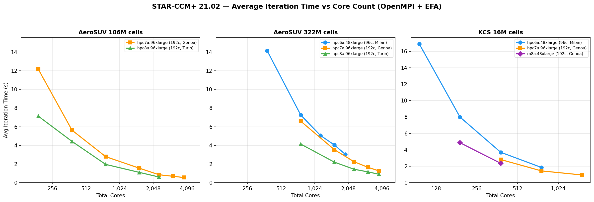

# STAR-CCM+

[Siemens Simcenter STAR-CCM+](https://plm.sw.siemens.com/en-US/simcenter/fluids-thermal-simulation/star-ccm/) is a multiphysics computational fluid dynamics (CFD) simulation software that enables engineers to model the complexity and explore the possibilities of products operating under real-world conditions. Recent software versions have included the capability to carry out Finite Element Analysis studies, and other physics phenomena that can be modelled in the software include battery and combustion modelling.

## Versions

There are 3 releases of STAR-CCM+ per year. There are two platform builds — x86 and Arm — each available for both Linux and Windows. There are also separate mixed precision and double (higher) precision builds available. Each of these have slightly different solve speeds and compute requirements with the double precision version (labelled -R8) having the higher requirements of the two. GPGPU compute capability is included within the x86 build (not a separate build). While submit scripts are mostly common across versions, there are nuances for x86, Arm and GPGPU usage to consider. The submit scripts in this repository are organised by version and architecture under `scripts/`.

## OS Compatibility

STAR-CCM+ works on many flavours of Linux, but by default is only supported on a small number of them. Recommended operating systems for running on AWS are Amazon Linux 2023, Ubuntu 20.04+, or RHEL8+. Note that as of STAR-CCM+ 2402 (19.02) and onwards, glibc >= 2.26 is required, and from 21.02 onwards glibc >= 2.28 is required. Amazon Linux 2 is end-of-life and should not be used.

| STAR-CCM+ Version | AL2023 | Ubuntu 20+ | RHEL8+ |
|-------------------|:-:|:-:|:-:|
| 18.06 (x86/GPU) | ✓ | ✓ | ✓ |
| 18.06 (Arm) | ✓ | ✓ | ✓ |
| 21.02+ (all) | ✓ | ✓ | ✓ |

## Installation

To install on a non-GUI based cluster, the following command can be used:

```
./STAR-CCM+_installer_.sh -i console -DPRODUCTEXCELLENCEPROGRAM=0 -DINSTALLDIR=/fsx/Siemens -DINSTALLFLEX=false -DADDSYSTEMPATH=true -DNODOC=false
```
This will provide a fast install to the specified location (`/fsx/Siemens`), without the license server or documentation being installed (the latter of which makes up a large chunk of the install size but may be useful). Please read the STAR-CCM+ installation guide for more information on parameters that can be set at install time.

## Key Settings

### License

There are multiple ways to license STAR-CCM+. The two most common methods are

- host a vendor supplied license on a license server
- use Power on Demand (PoD) which checks out a license from a Siemens hosted license server

Each method has its advantages and disadvantages, however it's worth noting that Power on Demand licenses are significantly easier to use with AWS; the license key can be placed as an argument when launching STAR-CCM+ and — as long as the instance can communicate with the internet — the license gets checked out.

The submit scripts in this repository use a `PODLIC` environment variable to pass the PoD key to STAR-CCM+. This is our suggested approach for keeping keys out of scripts. Set it in your user's environment variables (e.g. in `~/.bashrc`) or before submitting:

```bash
export PODLIC="your-pod-key-here"
sbatch submit_batch.sbatch -v 21.02.007 -s /fsx/simulations/model.sim
```

If running a license server on AWS, consider the following:

- Use a dedicated Elastic Network Interface (ENI) attached to the license server EC2 instance. This ensures the MAC address (which FlexLM ties the license to) persists even if the instance is terminated and replaced.
- For additional resilience, FlexLM supports a triad of license servers. This provides redundancy — if one server goes down, the remaining two can continue to serve licenses.
- Alternatively, a VPN connection can be used to reach a license server running outside of AWS.

### MPI

OpenMPI is the recommended MPI for Linux per the Siemens STAR-CCM+ user guide, and is required for AMD-based instances (e.g. hpc8a, hpc7a, hpc6a) where Intel MPI is unsupported and can crashes on STAR-CCM+ 21.02+ (e.g. during mesh repartitioning). All 21.02+ scripts in this repository use OpenMPI.

Intel MPI remains viable on Intel instances (hpc6id, c7i, c8i) and is retained in the 18.06 scripts where the version bundled with STAR-CCM+ works reliably across all tested platforms.

| Version | x86 | GPU | Arm |
|---------|-----|-----|-----|
| 18.06 | Intel MPI | Intel MPI | OpenMPI |
| 21.02+ | **OpenMPI** | **OpenMPI** | OpenMPI |

For OpenMPI, the key STAR-CCM+ flags are:

```
-mpi openmpi -xsystemlibfabric -ldlibpath /opt/amazon/efa/lib64 -fabric OFI
```

For Intel MPI (18.06 only), the environment variables required are:

```bash
export I_MPI_OFI_LIBRARY_INTERNAL=0
export I_MPI_FABRICS=shm:ofi
export I_MPI_OFI_PROVIDER=efa
export I_MPI_MULTIRAIL=1
```

### CPU Binding

No `-cpubind` flag is needed in the submit scripts. STAR-CCM+ defaults to `-cpubind bandwidth` which maximises memory bandwidth across NUMA nodes. Benchmarking confirmed this is 42–45% faster than `-cpubind off` on AMD multi-CCD architectures (hpc8a, hpc7a).

## Submit Scripts

Submit scripts are provided under `scripts/` organised by STAR-CCM+ version and architecture. Each directory contains a `submit_batch.sbatch` for headless batch runs and a `submit_server.sbatch` for interactive server mode (connect via the STAR-CCM+ GUI).

See [`scripts/README.md`](scripts/README.md) for full usage documentation, flag reference, and customisation options. Not setting `-m` options will cause the simulation to start running/solving.

```
scripts/
├── 18.06/                    # STAR-CCM+ 18.06 (works on AL2, AL2023, RHEL8, Ubuntu)
│   ├── x86/                  # Intel MPI
│   ├── gpu/                  # Intel MPI + GPU offload
│   └── arm/                  # OpenMPI (Intel MPI is x86-only)
└── 21.02/                    # STAR-CCM+ 21.02+ (requires glibc >= 2.28)
    ├── x86/                  # OpenMPI (recommended for all platforms)
    ├── gpu/                  # OpenMPI + GPU offload
    └── arm/                  # OpenMPI
```

Quick start:

```bash
# x86 batch run (default version is 21.02.007)
sbatch scripts/21.02/x86/submit_batch.sbatch -s /fsx/simulations/model.sim

# Specify a version explicitly
sbatch scripts/21.02/x86/submit_batch.sbatch -v 21.02.007 -s /fsx/simulations/model.sim

# Run with a Java macro
sbatch scripts/21.02/x86/submit_batch.sbatch -s /fsx/simulations/model.sim -m RunAndTimeSimulation.java

# Chain multiple batch commands (macro, then mesh, then solve)
sbatch scripts/21.02/x86/submit_batch.sbatch -s model.sim -m "macro.java,mesh,run"

# GPU batch run
sbatch scripts/21.02/gpu/submit_batch.sbatch -v 21.02.007 -s /fsx/simulations/model.sim

# Server mode (connect via STAR-CCM+ GUI)
sbatch scripts/21.02/x86/submit_server.sbatch -v 21.02.007 -s /fsx/simulations/model.sim
```

## Macros

### RunAndTimeSimulation.java

A benchmarking macro that runs configurable warmup + timed iterations, measures solve time and memory, exports all simulation reports, and writes results to CSV and JSON. See [`macros/RunAndTimeSimulation.java`](macros/RunAndTimeSimulation.java) for full documentation.

This macro has been used internally at AWS for STAR-CCM+ benchmarking in place of the default `starccm+ -benchmark` flag. It provides more control over the benchmarking process — configurable warmup iterations, per-step timing, memory measurement, and report export — and works with both steady and unsteady simulations.

**Use at your own risk.** This is not officially supported by Siemens. It is written in a readable form so is easy to audit.

Usage:

```bash
sbatch scripts/21.02/x86/submit_batch.sbatch -s /fsx/simulations/model.sim -m RunAndTimeSimulation.java
```


## Benchmarking Summary

AWS has benchmarked STAR-CCM+ 21.02 across a range of x86, Arm, and GPU instance types using OpenMPI with EFA. All CPU benchmarks below used full-node core counts (96 cores/node for hpc6a, 192 cores/node for hpc7a and hpc8a), 100 warmup iterations discarded, and 500 timed iterations.

### Scaling Comparison — hpc6a vs hpc7a vs hpc8a



The chart above compares average iteration time (lower is better) across three simulation cases:

- **AeroSUV 106M** — External aerodynamics, steady coupled solver, 106 million cells. Good scaling across all three instance families out to 20 nodes. hpc8a is consistently ~35–40% faster than hpc7a at the same core count.
- **AeroSUV 322M** — Same geometry at 322 million cells. Only hpc7a and hpc8a have sufficient memory per node to run this case efficiently - hpc6a benefits from 50% under-subscription. hpc8a maintains its advantage, reaching sub-1s/iter at 20 nodes (3,840 cores).
- **KCS 16M** — Ship hull hydrodynamics (unsteady, Segregated solver), 16 million cells. A smaller case that saturates earlier — scaling tails off beyond ~768 cores as communication overhead dominates.


### Key Takeaways

- **OpenMPI is now the default.** Intel MPI is no longer recommended on non-Intel instances. It crashes on AMD Turin/Genoa during mesh repartitioning in STAR-CCM+ 21.02+.
- **CPU binding matters.** The default `-cpubind bandwidth` is optimal; explicitly setting `-cpubind off` costs 42–45% performance on AMD multi-CCD architectures.
- **Warmup iterations are important for benchmarking.** The first ~100 iterations involve memory allocation overhead and should be discarded for timing purposes.
- **AL2023 is the recommended OS** for x86 and GPU instances (glibc 2.34). Amazon Linux 2 is no longer compatible with STAR-CCM+ 21.02+.
